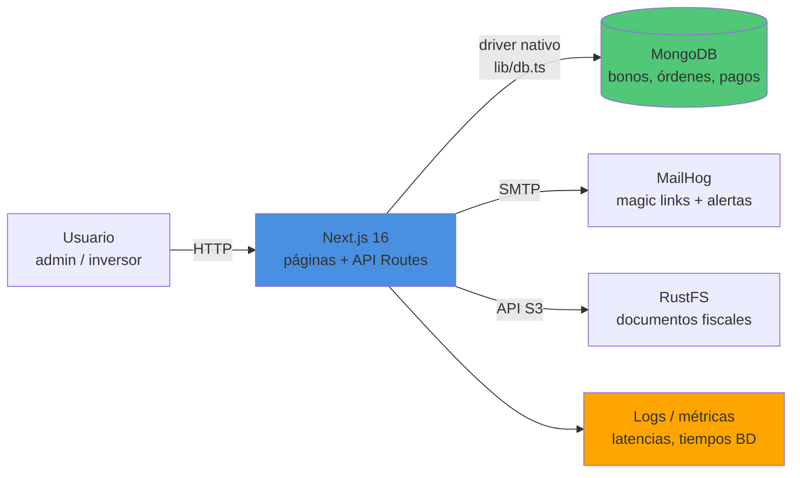

# 💰 Gestión de Bonos Corporativos

Aplicación fintech de deuda corporativa con **Next.js 16 + MongoDB**: el admin estructura emisiones de bonos y gestiona el bookbuilding; el inversor explora el screener, compra y sigue su cartera.

- **Especificación (QUÉ)**: [PROMPT.md](PROMPT.md)
- **Guía operativa (CÓMO)**: [AGENTS.md](AGENTS.md)
- **Arranque rápido**: [QUICKSTART.md](QUICKSTART.md)

## Arquitectura



## Instalación y arranque

```bash
# Servicios locales (MongoDB, MailHog, RustFS) — ver QUICKSTART.md
npm install
cp .env.example .env.local     # los valores por defecto funcionan en local
npm run seed                   # emisores, bonos, carteras + índices
npm run dev                    # http://localhost:3000
npm test                       # 24 tests (unitarios + integración)
```

Magic links visibles en [http://localhost:8025](http://localhost:8025) (MailHog).

## Funcionalidades

- **Admin**: estructuración de emisiones, libro de órdenes (bookbuilding), automatización de pagos (cupones + principal), cumplimiento y reportes.
- **Inversor**: screener con filtros (rating, YTM, vencimiento, sector), tablero de posición, alertas.

## Decisiones de diseño

- **Importes en céntimos y tasas en puntos básicos** (enteros): cero errores de redondeo.
- **Los pagos programados se persisten** al adjudicar (no se calculan al vuelo): simplifica tablero y alertas.
- **Precio de mercado derivado del modelo**: valor presente de los flujos restantes descontados a la tasa exigida por el rating del emisor (sin cotizaciones externas). La YTM del screener se obtiene por bisección.
- **Cupón variable** = referencia simulada (`EURIBOR-SIM`, colección `rates`) + spread, fijado al adjudicar.
- **Roles comprobados en servidor** (JWT con `jose`); `proxy.ts` (Next 16) protege las zonas `/admin` e `/investor`.

<!-- TODO: sección de métricas medidas bajo carga (ver PROMPT.md §5/§8) -->
<!-- TODO: guía de deployment cuando se defina plataforma (PROMPT.md §9) -->
